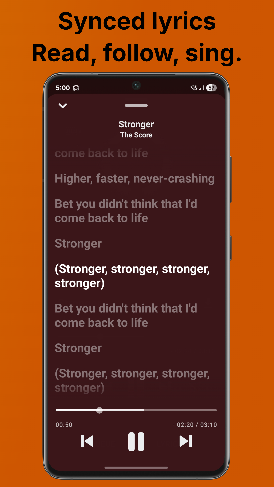

<div align="center">
    
    <h1>AudioScape</h1>

**An Android Application For Streaming Music From YouTube Music Build With React-Native Using Expo.**


**Built With The Tools & Technologies:**


</div>

## 📱 Screenshots

<div align="center">
   
   
   
   
   
   
</div>

## ✨ Features

- Play songs from YouTube Music
- Background playback with stop when app swipe out from task manager
- Add Songs To Favorites Category
- Dynamic Player Background
- Create Playlists
- Search for songs
- Automatically check for updates
- Synced Lyrics
- Download Songs

## 📲 Installation

[](https://github.com/ankushcodes69/AudioScape/releases/latest)

## 🤝 Contributing

**You need a YouTube 'po token' api to develop the app yourself**

- You can find the code for the api at: https://github.com/ankushcodes69/YouTubeApi

- You can either host the api locally or use "https://render.com/" to host the api (recommended), either way add the link to a **.env** (reffer to .env.example) file and **don't forget to give '/data' at the end of the api link**.

_Example :_

```
EXPO_PUBLIC_PO_TOKEN_API="https://<your render project name>.onrender.com/data"
```

**Pull requests are welcome**

- If you want to **develop new functions** or **fix a bug**, fork the repository and send a pull request.

## 🫂 Acknowledgments

- [**YouTube.js**](https://github.com/LuanRT/YouTube.js): A JavaScript client for YouTube's private API
- [**LrcLib**](https://lrclib.net): Lyrics provider
- [**react-native-spotify-lyrics**](https://github.com/uragirii/react-native-spotify-lyrics): Main logic for the synced lyrics feature

## 📝 License

```
AudioScape is a free software licensed under GPL v3.0 with following condition.

- Copied/Modified version of this software can not be used for 'non-free' and profit purposes.
- You can not publish copied/modified version of this app on closed source app repository
  like PlayStore/AppStore.

```

## ❗ Disclaimer

```
This project has been created while learning & learning is the main intention.
This project is not sponsored or affiliated with, funded, authorized, endorsed by any content provider.
Any Song, content, trademark used in this app are intellectual property of their respective owners.
AudioScape is not responsible for any infringement of copyright or other intellectual property rights that may result
from the use of the songs and other content available through this app.

This Software is released "as-is", without any warranty, responsibility or liability.
In no event shall the Author of this Software be liable for any special, consequential,
incidental or indirect damages whatsoever (including, without limitation, any
other pecuniary loss) arising out of the use of inability to use this product, even if
Author of this Sotware is aware of the possibility of such damages and known defect.
```
