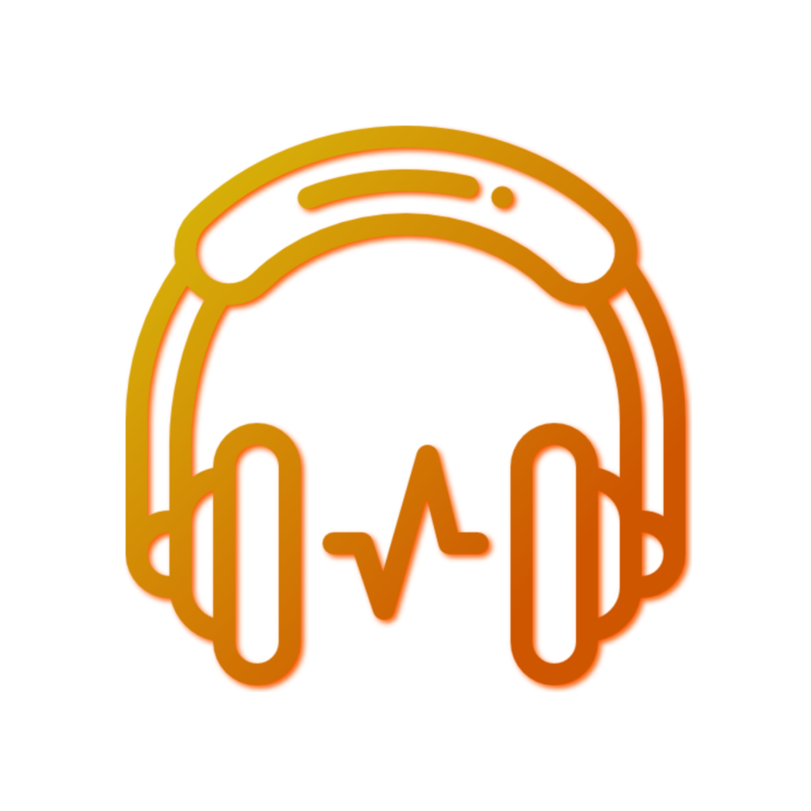

    
    <h1>AudioScape</h1>
    
A Android Application For Streaming Music From YouTube Music Build With React-Native Using Expo.

    

## ✨ Features
- Play songs from YouTube Music
- Background playback with stop when app swipe out from task manager
- Add Songs To Favorites Category
- Dynamic Player Background

## 📲 Installation

## 🤝 Contributing
**Pull requests are welcome**
- If you want:
    - to **develop new functions** or **fix a bug**, fork the repository and send a pull request.

## 🫂 Acknowledgments
- [**YouTube.js**](https://github.com/LuanRT/YouTube.js): A JavaScript client for YouTube's private API

## ❗ Disclaimer
This project and its contents are not affiliated with, funded, authorized, endorsed by, or in any way associated with YouTube, Google LLC or any of its affiliates and subsidiaries.

Any trademark, service mark, trade name, or other intellectual property rights used in this project are owned by the respective owners.
